<p align="center">
  
</p>

<p align="center"><b>Drop a file, tap <em>Tidy up</em>, get it filed.</b> Your Google Drive, your notes; a Claude agent does the filing.<br>
Self-hosted, zero servers, 0 € a month.</p>

<p align="center">
  <a href="https://github.com/deluispablo/bower/actions/workflows/ci.yml"></a>
  <a href="#cost"></a>
  <a href="https://claude.com/claude-code"></a>
  <a href="https://github.com/features/actions"></a>
  <a href="https://www.cloudflare.com"></a>
  <a href="LICENSE"></a>
</p>

<table align="center">
  <tr>
    <td align="center">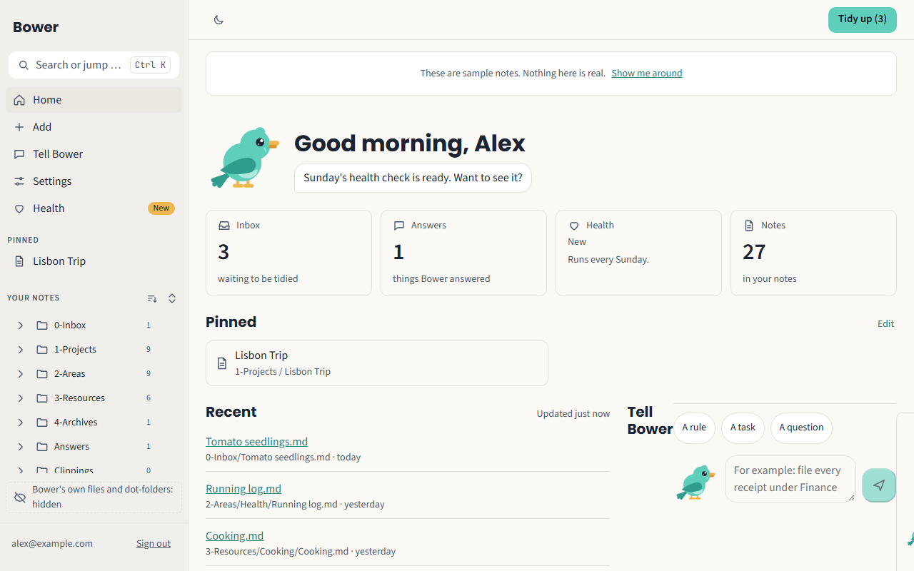<br><sub>Home</sub></td>
    <td align="center">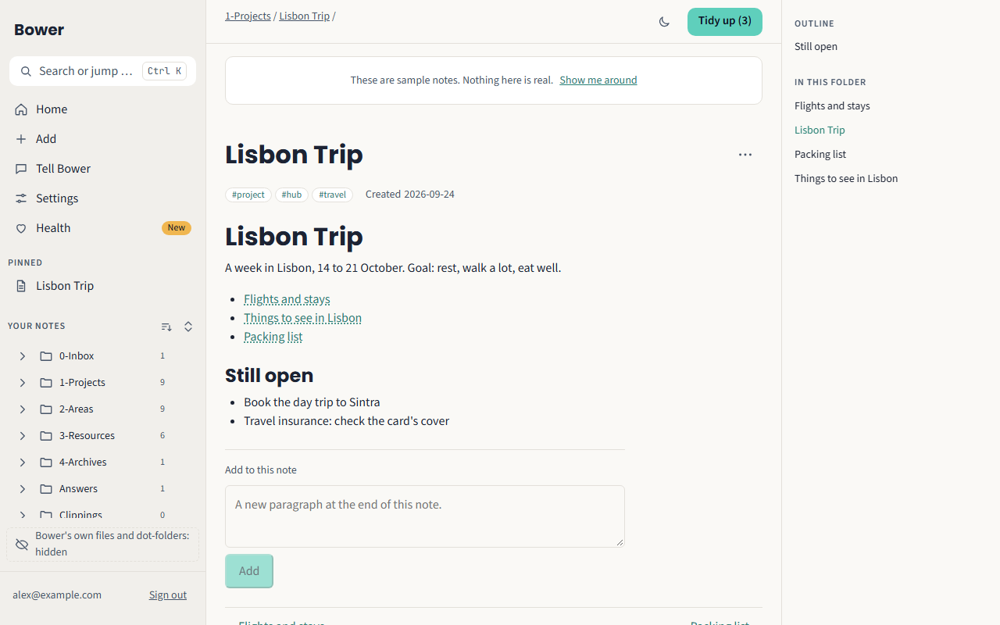<br><sub>A note</sub></td>
    <td align="center">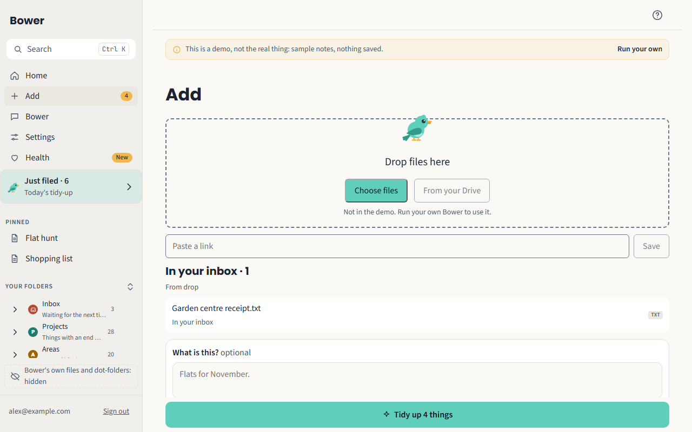<br><sub>Add</sub></td>
  </tr>
  <tr>
    <td align="center">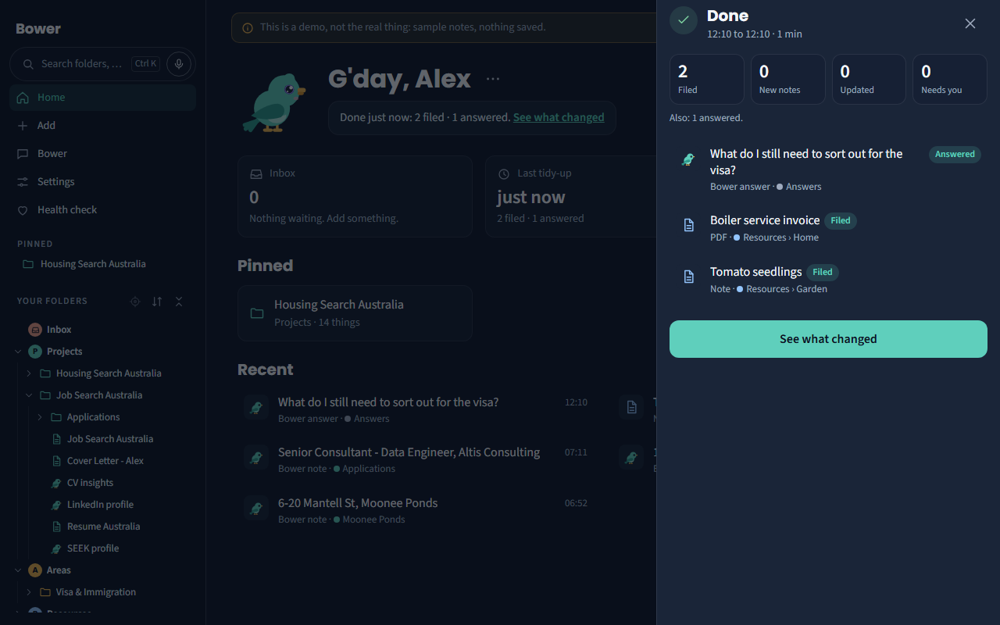<br><sub>Tidy up</sub></td>
    <td align="center">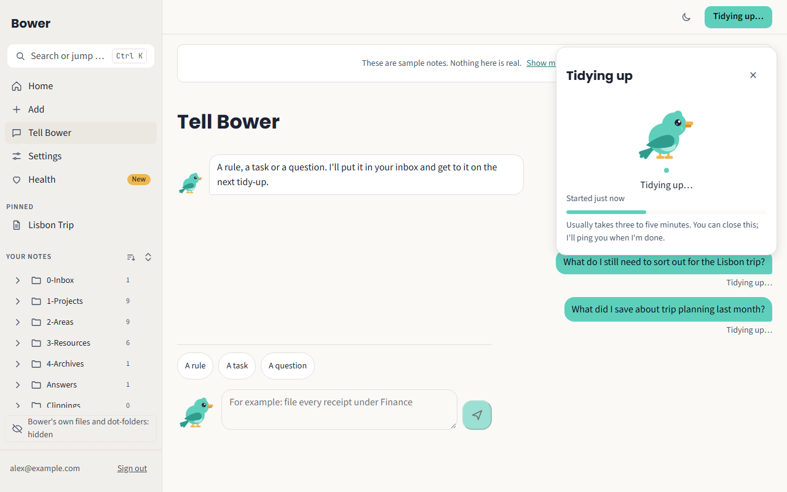<br><sub>The Bower tab</sub></td>
    <td align="center">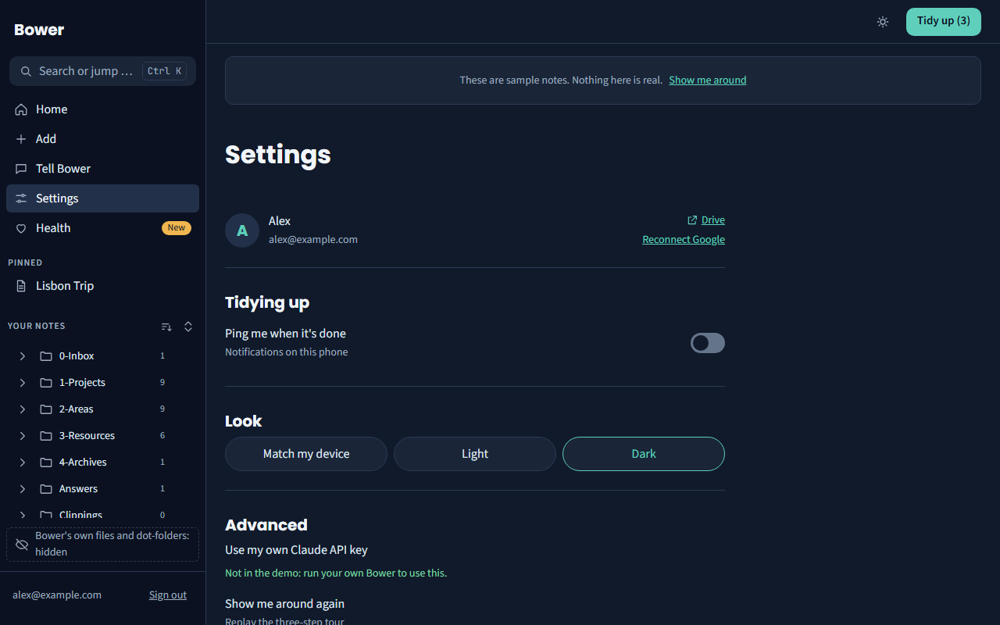<br><sub>Settings, dark</sub></td>
  </tr>
</table>

<p align="center"><sub>Screenshots of the demo, taken by the end-to-end tests (<code>pnpm -C app e2e:shots</code>).</sub></p>

---

## Why a bowerbird

The bowerbird lives only in Australia and New Guinea. The male spends his days collecting bright things (shells, feathers, flowers, the odd blue bottle cap), arranging them in front of his bower of twigs, sorted by colour and size, and then showing the whole thing off. It is the tidiest animal there is, and it does all of it to impress.

That is the job Bower does for your notes. It collects what you throw at it (photos, PDFs, links, voice memos, half-thoughts) and keeps it as tidy Markdown in a folder of **your own Google Drive**. You read it in the app, or in Obsidian pointed at the same folder. Nothing leaves your account; the people who run the instance never see a note.

<p align="center"></p>

## What it is, and what it is not

<p align="center"></p>

The details are in [What Bower is not](#what-bower-is-not), below.

## How it works

<p align="center"></p>

1. **Add something.** From your phone or your PC: drop a file, share from any app, paste a link, or just type.
2. **Tap Tidy up.** Nothing runs on a schedule. When you tap, the bird wakes up in the background and you carry on.
3. **It reads enough to know what it is.** A receipt, a lease, a photo of a sign, a job offer.
4. **It files it.** The original itself moves into the folder you told it to use, or, where you said nothing, where PARA says: a project if it has an end, an area if it is ongoing, a resource if it is reference, the archive when it is done. A name that says nothing (`IMG_4471.jpg`) becomes one that does; the folder's page and the index get one line each. No summary, no copy, no translation unless you ask.
5. **It writes a note when there is something to write.** A web clip or a saved link becomes a note; a Word, OpenDocument, HTML, EPUB or RTF document gets a Markdown copy filed next to the original; and when you say what you want (**What is this?** on Add, or a rule), it does that too: a table, a summary, a translation. With **Let Bower look things up on the web** turned on in Settings, and allowed by whoever runs your Bower, it may search the web to fill in what a document leaves out.
6. **It remembers and connects.** Ask once and it becomes a rule in your rulebook. Everything it keeps for you is one more thing it can join to the next: the job ad gets a commute from the flat you shortlisted.
7. **Read it anywhere.** In the app, or in Obsidian on the same folder.

## What the bird does with your files

Filing is the half you see. The other half is that Bower **reads** what you save, **files** it where it belongs, **looks up** what it does not say, **writes** the note you would have written with a free afternoon, **remembers** how you like it done, and **connects** it to everything else it keeps for you.

<p align="center"></p>

| You save | Bower works | You get |
| --- | --- | --- |
| Three rental listings, as you find them: a link, a screenshot, a photo of a sign. | 68 m², 2 bed. Filed: Flat hunt / Camden. Tube 6 min, 10 % under the area. 14 min by bike from your interview. | A note per flat, filed by district, and one that ranks them with a checklist for the visit. |

**One case per letter of PARA.** A **project**: flat hunting, every listing ranked and every job ad measured against the flats. An **area**: your health, each lab report filed and one table that shows what changed over the year. A **resource**: six articles on sourdough become one digest that says where they disagree. The **archive**: a finished trip filed away with what to remember, nothing deleted.

**It remembers.** Ask once, in plain English, and it becomes a rule in your rulebook. **It joins the dots.** It tells you what you would not have noticed, and never what you already know.

## What Bower is not

<p align="center"></p>

Bower is a window onto one folder of your own Google Drive. Everything else follows from that.

| | |
| --- | --- |
| **Not an editor** | It reads, files and writes notes for you. To write yourself, open the folder in Obsidian or any text editor; it is plain Markdown, and Bower picks up your changes on the next tidy-up. |
| **Not a place your things are stored** | Nothing of yours lives on a Bower server: the Worker keeps your sign-in and a pointer to the folder, never a note. The tidy-up runs on a temporary copy that is deleted when it ends. |
| **Not the only way in** | The folder is plain Markdown in your Drive, so open it with anything: Obsidian as a vault, Google Docs, a file manager, your phone's Files app. They can add their own dot-folders (`.obsidian`, `.trash`); Bower hides those and never touches them, and reads your edits at the next tidy-up. |
| **Not another app to move your life into** | No import, no export. It points at a folder in the Drive you already have. Delete the app and the folder, the notes and the rules are still there. |

## What makes it different

<p align="center"></p>

| | |
| --- | --- |
| **Your data, your account** | Notes are plain Markdown in your Drive. Delete the app and they are still there. |
| **One button** | No inbox zero rituals. Add things all week, tap once. |
| **A rulebook you can read** | The agent follows a `CLAUDE.md` in your folder, in plain English. Every rule you give it is written there, dated. |
| **Talk to it** | In the Bower tab, type or say what you want: a rule, a task or a question. It waits in the inbox with everything else and is done at the next tidy-up. |
| **Works offline** | The app is a PWA: your notes are cached, adding waits for signal. |
| **0 € to run** | Cloudflare and GitHub free tiers; you bring a Claude subscription and a Drive. |
| **A bird with a job** | The mascot is not decoration. It looks around when idle, peeks over the drop zone, sings while you type, carries papers to the nest while it works, and dances when it's done. |

## The app

One explorer, on every screen size: on a computer it is the left column, on a phone it is the **Notes** tab. It shows your notes and files as rows, starts with what you pinned and the five places Bower keeps things, opens to whatever you are reading, and hides the app's own files. Search finds a name, a folder or words inside a note, even with a typo, and works on the phone as well as the desktop. The screenshots at the top are the real app, running the demo.

| Screen | What you see |
| --- | --- |
| Home | The bird greets you and tells you what is waiting. After a tidy-up it says what it filed and links to **Just filed**. Inbox and Answers counts, recent notes with their key facts, one search field. |
| Notes | Your notes and files as one explorer: pinned things first, your folders below, **New** on what the last tidy-up filed and you have not opened yet. |
| Just filed | What the last tidy-up did: each thing with the name it had, the name it has now and the folder it went to, what Bower set aside and why, and what it added. |
| A folder | Rows with a small mark for what each is, sorted and filtered by kind, grouped by date. A file and the note Bower wrote about it sit side by side. Notes of one kind, such as receipts or bookings, can be **compared** in a table, or as cards on a phone. |
| A note | Reading first: the title, the key facts, Bower's note as a callout that says where each line came from, and **Check** when it needs you. Previous and next in the folder; on a desktop, an outline and an About panel. |
| A file | A PDF, a photo, a spreadsheet, a video: shown as Drive allows, with its facts (pages, sheets, what is in a ZIP) and the note Bower wrote about it. **Move to…** asks Bower to file it somewhere else, now or at the next tidy-up. |
| Search | Groups, kind chips and a scope. On a desktop, two columns with a preview of the highlighted result. |
| Add | A drop zone the bird peeks over, camera, paste-a-link, upload progress, and a box for saying what a file is. |
| Bower | Tell Bower what you want in your own words. **Rules** lists every rule, grouped by topic; **Requests** what is waiting, being done or answered; **Activity** what each tidy-up did. The bird sings while you type. |
| Tidying up | A sheet with the inbox-to-nest scene, what has been filed and where. |
| First run | The bird builds your Bower folder in front of you, then shows you around in three steps. Once per account. |

Still to come (issues #613 and #614): a grid view of a folder, a quick look at a file without leaving the list, and side-by-side panes on the desktop.

## For engineers

### Architecture

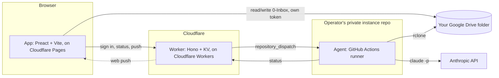

### One tidy-up, end to end

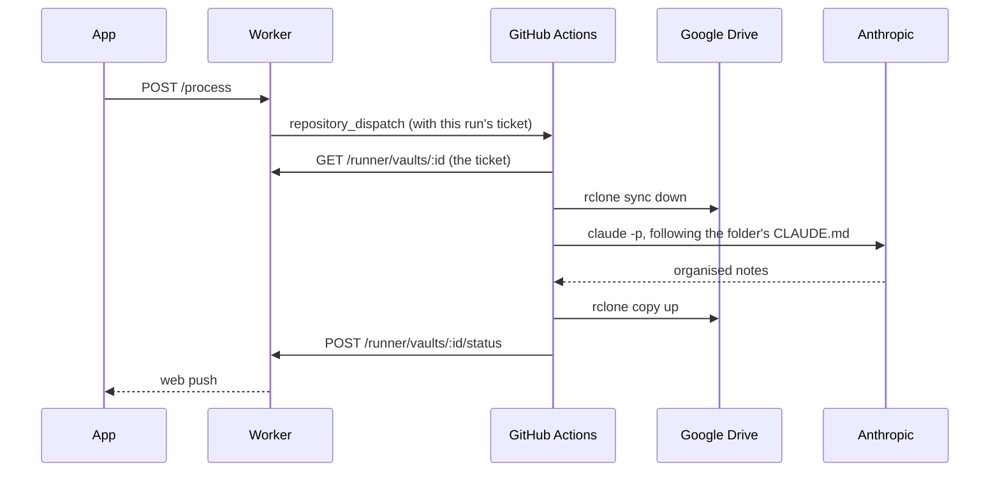

What happens after the agent has filed, in the order it runs (details in `docs/runbook.md`, "One tidy-up, phase by phase"):

- **Reconcile.** Before anything else the runner lists the Bower folder with Drive ids and compares it with the list it saved last time. A file you moved in Drive or Obsidian gets its row in `index.md` rewritten and a line in `log.md`.
- **Moves by script.** The agent never moves a file in Drive. When it finishes, the runner moves each file it filed or renamed in Drive itself, so the file keeps its Drive id and any link to it keeps working.
- **Bookkeeping.** Without AI, the runner then records each move in `index.md`, in the links that name the file and in `log.md`.
- **Report.** The run ends with a report of what went where, which the app shows as **Just filed** and marks **New** on what you have not opened yet.

### Components

| Component | Tech | Runs on |
| --- | --- | --- |
| `app/` | Preact + Vite + TypeScript, a service worker for the shell cache, share target and push | Cloudflare Pages (free), in your browser |
| `api/` | Hono + KV + Web Crypto | Cloudflare Workers + KV (free) |
| `agent/` | Bash (`run.sh`) + rclone + the Claude Code CLI | GitHub Actions of the operator's own private instance repo (free tier) |
| `vault-template/` | Markdown notes and a `CLAUDE.md` rulebook | Copied into each user's Google Drive on first sign-in |

### Principles

- **The folder is the only state.** Your Drive holds every note; the Worker keeps credentials and pointers, never content; the runner keeps nothing once a run ends.
- **Cost first.** Free tiers only, no servers, no database of note content; a dependency that would break this needs a decision entry first (`docs/decisions.md`).
- **No personal data, ever.** Not in code, tests, fixtures, docs or commits, enforced by a CI grep gate (`scripts/check-sanitized.sh`).
- **Rules are data.** The agent's behaviour lives in the folder's own `CLAUDE.md`, changed only through a dated instruction note; it never edits its own rules unasked.
- **On demand, never scheduled.** A tidy-up runs when you tap. The only scheduled job is a weekly health check that reports and never moves a file.

Full module map, data flows, credentials and threat model: [`ARCHITECTURE.md`](ARCHITECTURE.md).

## Cost

| Piece | Tier | Cost |
| --- | --- | --- |
| Cloudflare Workers, KV, Pages | Free tier | 0 € |
| GitHub Actions | Free tier of a private repo: 2,000 minutes/month | 0 € |
| Anthropic (Claude) | Your existing subscription, or pay-as-you-go API usage | Subscription or API cost |
| Google Drive | Your existing storage | 0 € |
| A domain | The app and the Worker share one registrable domain, for the session cookie ([`docs/security.md`](docs/security.md)) | The only thing that can cost money |

Running your own instance is 0 € beyond a domain you likely already have, and whatever your Claude usage costs.

## Repo layout

```
app/             PWA (Vite + Preact + TS)            → Cloudflare Pages
api/             Worker (Hono + KV + Web Crypto)     → Cloudflare Workers
agent/           run.sh, prompts/, workflows/         → operator's private instance repo (GitHub Actions)
vault-template/  the folder every user starts from    → copied into the user's Drive
docs/            runbook, decisions, brand, design, testing
scripts/         deploy.sh, new-instance.sh, checks
```

## Deploy your own

Full walkthrough: [`docs/runbook.md`](docs/runbook.md). Short version, driven mostly by [`scripts/deploy.sh`](scripts/deploy.sh):

1. Get the accounts: Cloudflare, a Google Cloud project, GitHub, and a Claude subscription or API key ([runbook §1](docs/runbook.md#1-accounts-you-need)).
2. Create the Google OAuth client and publish its consent screen ([runbook §2](docs/runbook.md#2-google-oauth-client)).
3. Run `bash scripts/deploy.sh`. It creates your private instance repo, the Worker, KV and Pages, and sets every secret it can generate itself.
4. Do the two things it cannot: set the app's custom domain in the Cloudflare dashboard, and check the OAuth client's redirect URI; both printed by the script with your real values.
5. Invite yourself with the one-line allowlist command in the runbook (§5), sign in, and let the bird show you around.

## Status

Shipped: M1 to M33, from the first API to the explorer and the file views.

Next, v5 (milestones M34 to M46, planned in [`PLAN.md`](PLAN.md) from the spec [`docs/superpowers/plans/2026-09-29-runs-notes-folders-spec.md`](docs/superpowers/plans/2026-09-29-runs-notes-folders-spec.md)):

- **Every tidy-up says what it did**, in four counts (filed, new notes, updated, needs you), and a bar follows you on every screen while it runs.
- **Bower's note** on every note it writes, folded to one line when you want, with a verdict and next steps where it helps.
- **Piles:** add things together and say in one line what they are; uploads survive a closed tab.
- **Dictation** wherever you write a sentence, and a short intro plus a **Learn Bower** page.
- **Bower on screen:** the bird, redrawn as a satin bowerbird, keeps you company without getting in the way.
- **A missing Bower folder** is noticed and can be put back.

Why things are built this way: [`docs/decisions.md`](docs/decisions.md). What an instance stores about you: [`docs/privacy.md`](docs/privacy.md). Contributing: [`CONTRIBUTING.md`](CONTRIBUTING.md).

## Credits

Built by [Pablo de Luis](https://github.com/deluispablo), with Claude Code doing the typing. MIT licensed. The bird is drawn from the satin bowerbird, violet eye and blue bottle cap included, which really does collect, sort and show off; the brand is described in [`docs/brand.md`](docs/brand.md).
