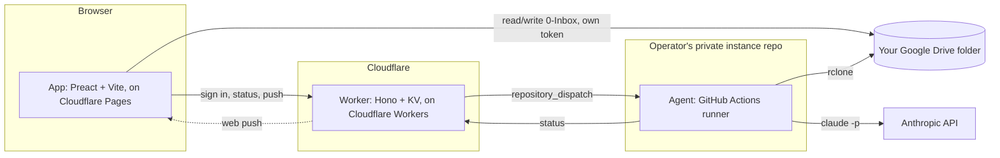

<p align="center">
  
</p>

<h1 align="center">Bower</h1>

<p align="center"><strong>A second brain that files itself.</strong><br>
Drop a file, tap <em>Tidy up</em>, get a note. Your Google Drive, your notes; a Claude agent does the filing.<br>
Self-hosted, zero servers, 0 € a month.</p>

<p align="center">
  <a href="https://github.com/deluispablo/bower/actions/workflows/ci.yml"></a>
  <a href="#cost"></a>
  <a href="https://claude.com/claude-code"></a>
  <a href="https://github.com/features/actions"></a>
  <a href="https://www.cloudflare.com"></a>
  <a href="LICENSE"></a>
</p>

---

Bower is named after the bowerbird, which collects bright things and arranges them with care in its bower. This one collects what you throw at it (photos, PDFs, links, voice memos, half-thoughts) and keeps it as tidy Markdown notes in a folder of **your own Google Drive**. You read them in the app, or in Obsidian pointed at the same folder. Nothing leaves your account; the people who run the instance never see a note.

## How it works

<p align="center"></p>

1. **Add something.** From your phone or your PC: drop a file, share from any app, paste a link, or just type.
2. **Tap Tidy up.** Nothing runs on a schedule. When you tap, the bird wakes up in the background and you carry on.
3. **It gets filed.** Summarised, given a title and tags, organised with PARA (Projects, Areas, Resources, Archives), linked to what you already have, with a short note about what was done and why.
4. **Read it anywhere.** In the app, with a quick switcher and a real file explorer, or in Obsidian on the same folder.
5. **Tell Bower how you like things.** A rule ("file receipts under Finance"), a task ("compare my last three phone plans"), a question ("when does my passport expire?"). Rules are kept for good; questions get answered in a note.

## What makes it different

| | |
| --- | --- |
| **Your data, your account** | Notes are plain Markdown in your Drive. Delete the app and they are still there. |
| **One button** | No inbox zero rituals. Add things all week, tap once. |
| **A rulebook you can read** | The agent follows a `CLAUDE.md` in your folder, in plain English. Every rule you give it is written there, dated. |
| **Talk to it** | Rules, tasks and questions go through the same inbox as everything else. |
| **Works offline** | The app is a PWA: your notes are cached, adding waits for signal. |
| **0 € to run** | Cloudflare and GitHub free tiers; you bring a Claude subscription and a Drive. |
| **A bird with a job** | The mascot is not decoration. It looks around when idle, peeks over the drop zone, sings while you type, carries papers to the nest while it works, and dances when it's done. |

## The app

A redesign is under way ([milestones M6 to M10](../../milestones)): an Obsidian-like look, a file explorer that hides the app's own files, a quick switcher, and the bird on every screen. The screens are designed and committed under [`docs/design/screens/`](docs/design/screens/); open any of them in a browser. Real screenshots land with [#152](../../issues/152).

| Screen | What you see |
| --- | --- |
| Home | The bird greets you and tells you what is waiting. Inbox and Answers counts, recent notes, one search field. |
| Note | Reading first: title, tags, dates, the body with a comfortable measure, the agent's note as a callout, previous and next in the folder. On desktop, an outline and linked mentions. |
| Add | A drop zone the bird peeks over, camera, paste-a-link, upload progress. |
| Tell Bower | A conversation. The bird sings while you type. |
| Tidying up | A sheet with the inbox-to-nest scene, what has been filed and where. |
| First run | The bird builds your folder in front of you, then shows you around in three steps. Once per account. |

## For engineers

### Architecture



### One tidy-up, end to end


### Components

| Component | Tech | Runs on |
| --- | --- | --- |
| `app/` | Preact + Vite + TypeScript, a service worker for the shell cache, share target and push | Cloudflare Pages (free), in your browser |
| `api/` | Hono + KV + Web Crypto | Cloudflare Workers + KV (free) |
| `agent/` | Bash (`run.sh`) + rclone + the Claude Code CLI | GitHub Actions of the operator's own private instance repo (free tier) |
| `vault-template/` | Markdown notes and a `CLAUDE.md` rulebook | Copied into each user's Google Drive on first sign-in |

### Principles

- **The folder is the only state.** Your Drive holds every note; the Worker keeps credentials and pointers, never content; the runner keeps nothing once a run ends.
- **Cost first.** Free tiers only, no servers, no database of note content; a dependency that would break this needs a decision entry first (`docs/decisions.md`).
- **No personal data, ever.** Not in code, tests, fixtures, docs or commits, enforced by a CI grep gate (`scripts/check-sanitized.sh`).
- **Rules are data.** The agent's behaviour lives in the folder's own `CLAUDE.md`, changed only through a dated instruction note; it never edits its own rules unasked.
- **On demand, never scheduled.** A tidy-up runs when you tap. The only scheduled job is a weekly health check that reports and never moves a file.

Full module map, data flows, credentials and threat model: [`ARCHITECTURE.md`](ARCHITECTURE.md). The design of the app, screen by screen: [`docs/design/`](docs/design/) and the [spec](docs/superpowers/specs/2026-09-27-app-redesign-design.md).

## Cost

| Piece | Tier | Cost |
| --- | --- | --- |
| Cloudflare Workers, KV, Pages | Free tier | 0 € |
| GitHub Actions | Free tier of a private repo: 2,000 minutes/month | 0 € |
| Anthropic (Claude) | Your existing subscription, or pay-as-you-go API usage | Subscription or API cost |
| Google Drive | Your existing storage | 0 € |
| A domain | The app and the Worker share one registrable domain, for the session cookie ([`docs/security.md`](docs/security.md)) | The only thing that can cost money |

Running your own instance is 0 € beyond a domain you likely already have, and whatever your Claude usage costs.

## Repo layout

```
app/             PWA (Vite + Preact + TS)            → Cloudflare Pages
api/             Worker (Hono + KV + Web Crypto)     → Cloudflare Workers
agent/           run.sh, prompts/, workflows/         → operator's private instance repo (GitHub Actions)
vault-template/  the folder every user starts from    → copied into the user's Drive
docs/            runbook, decisions, brand, design, testing
scripts/         deploy.sh, new-instance.sh, checks
```

## Deploy your own

Full walkthrough: [`docs/runbook.md`](docs/runbook.md). Short version, driven mostly by [`scripts/deploy.sh`](scripts/deploy.sh):

1. Get the accounts: Cloudflare, a Google Cloud project, GitHub, and a Claude subscription or API key ([runbook §1](docs/runbook.md#1-accounts-you-need)).
2. Create the Google OAuth client and publish its consent screen ([runbook §2](docs/runbook.md#2-google-oauth-client)).
3. Run `bash scripts/deploy.sh`. It creates your private instance repo, the Worker, KV and Pages, and sets every secret it can generate itself.
4. Do the two things it cannot: set the app's custom domain in the Cloudflare dashboard, and check the OAuth client's redirect URI; both printed by the script with your real values.
5. Invite yourself with the one-line allowlist command in the runbook (§5), sign in, and let the bird show you around.

## Status

Shipped: M1 · API and onboarding, M2 · Agent, M3 · App v1, M4 · Public release. In progress: the redesign.

| Milestone | What | Issues |
| --- | --- | --- |
| [M6 · Redesign: foundations](../../milestone/7) | Tokens and fonts, the bird as a component and as the mark, Process renamed Tidy up, this README | [#136](../../issues/136) [#137](../../issues/137) [#138](../../issues/138) [#139](../../issues/139) |
| [M7 · Redesign: shell and explorer](../../milestone/8) | Three-column desktop, phone nav and drawer, hidden app files, quick switcher | [#140](../../issues/140) [#141](../../issues/141) [#142](../../issues/142) |
| [M8 · Redesign: screens](../../milestone/9) | Every route with the bird: Home, Note, Add, Tell, the Tidying up sheet, Settings, Health | [#143](../../issues/143) to [#148](../../issues/148) |
| [M9 · Redesign: first run](../../milestone/10) | Welcome, folder, Building your bower, the tour, once per account | [#149](../../issues/149) |
| [M10 · Redesign: phase 2](../../milestone/11) | Linked mentions, per-message status from the runner, real screenshots | [#150](../../issues/150) [#151](../../issues/151) [#152](../../issues/152) |
| [M5 · Next](../../milestone/6) | Append to a note, editing, semantic search, Google Picker, email-in | [issues](../../milestone/6) |

Why things are built this way: [`docs/decisions.md`](docs/decisions.md). What an instance stores about you: [`docs/privacy.md`](docs/privacy.md). Contributing: [`CONTRIBUTING.md`](CONTRIBUTING.md).

## Credits

Built by [Pablo de Luis](https://github.com/deluispablo), with Claude Code doing the typing. MIT licensed. The bird is drawn from a satin bowerbird, which really does steal blue things for its nest.
