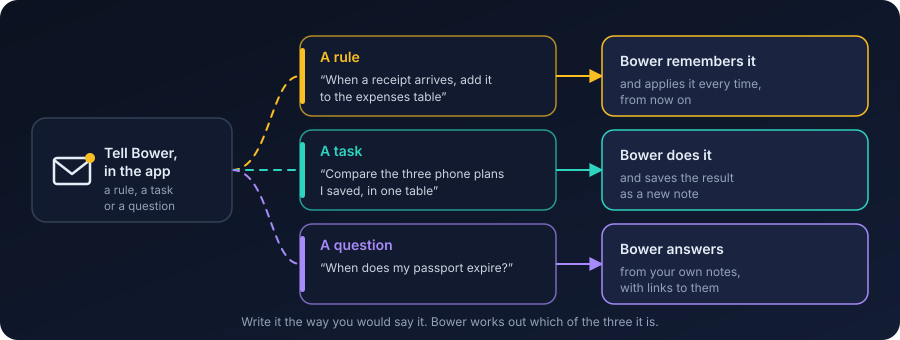
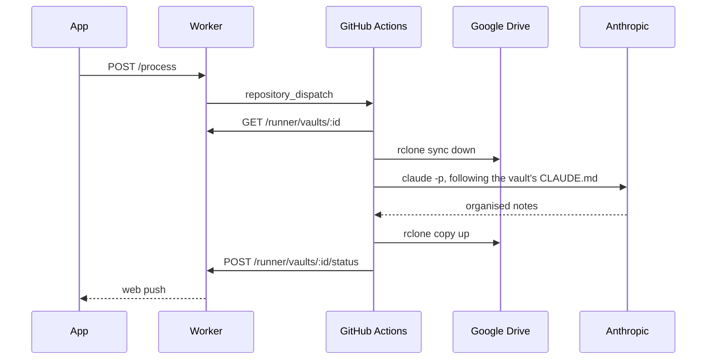

# Bower

[](https://github.com/deluispablo/bower/actions/workflows/ci.yml)
[](#cost)
[](https://claude.com/claude-code)
[](https://github.com/features/actions)
[](https://www.cloudflare.com)
[](LICENSE)

Bower keeps your notes organised in your own Google Drive. You add things, Bower files them, and you can read everything in the app or in Obsidian.

## How it works

1. **Add something** — drop a file into the app, or type a note, from your phone or your PC.
2. **Press Process** — Bower wakes up in the background; you don't wait for it.
3. **It gets filed** — summarised, organised with PARA (Projects, Areas, Resources, Archives), linked to what you already have.
4. **Read it anywhere** — in the app, or in Obsidian pointed at the same Google Drive folder.
5. **Talk to change how it works** — see below.

<p align="center"></p>

### Talking to Bower

A note in your inbox named `Bower - ...` is read the same way as anything else, and is one of three things:

- **A rule** ("From now on, when a receipt arrives, add it to the expenses table") is written into the rulebook that guides Bower, in plain English, dated.
- **A task** ("Compare my last three phone plans") gets done, and the result is filed where it belongs.
- **A question** ("When does my passport expire?") gets answered in an `Answers` note, linked to whatever it used to answer it.

<p align="center"></p>

<!-- demo GIF: docs/assets/demo.gif, recorded by the owner with a demo vault -->

## For engineers

### Architecture


### Sequence of one run



### Components

| Component | Tech | Runs on |
| --- | --- | --- |
| `app/` | Preact + Vite + TypeScript, a service worker for the shell cache, share target and push | Cloudflare Pages (free), in your browser |
| `api/` | Hono + KV + Web Crypto | Cloudflare Workers + KV (free) |
| `agent/` | Bash (`run.sh`) + rclone + the Claude Code CLI | GitHub Actions of the operator's own private instance repo (free tier) |
| `vault-template/` | Markdown notes and a `CLAUDE.md` rulebook | Copied into each user's Google Drive on first sign-in |

### Principles

- **The vault is the only state.** Your Drive holds every note; the Worker keeps credentials and pointers, never content; the runner keeps nothing once a run ends.
- **Cost first.** Free tiers only, no servers, no database of note content; a dependency that would break this needs a decision entry first (`docs/decisions.md`).
- **No personal data, ever.** Not in code, tests, fixtures, docs or commits — enforced by a CI grep gate (`scripts/check-sanitized.sh`).
- **Rules are data.** The agent's behaviour lives in the vault's own `CLAUDE.md`, changed only through a dated instruction note; it never edits its own rules unasked.

Full module map, data flows, credentials and threat model: [`ARCHITECTURE.md`](ARCHITECTURE.md).

## Cost

| Piece | Tier | Cost |
| --- | --- | --- |
| Cloudflare Workers, KV, Pages | Free tier | 0 € |
| GitHub Actions | Free tier of a private repo: 2,000 minutes/month | 0 € |
| Anthropic (Claude) | Your existing subscription, or pay-as-you-go API usage | Subscription or API cost |
| Google Drive | Your existing storage | 0 € |
| A domain | The app and the Worker share one registrable domain, for the session cookie ([`docs/security.md`](docs/security.md)) | The only thing that can cost money |

Running your own instance is 0 € beyond a domain you likely already have, and whatever your Claude usage costs.

## Repo layout

```
app/             PWA (Vite + Preact + TS)            → Cloudflare Pages
api/             Worker (Hono + KV + Web Crypto)     → Cloudflare Workers
agent/           run.sh, prompts/, workflows/         → operator's private instance repo (GitHub Actions)
vault-template/  the vault every user starts from     → copied into the user's Drive
docs/            runbook, decisions, brand, testing
scripts/         deploy.sh, new-instance.sh, checks
```

## Deploy your own

Full walkthrough: [`docs/runbook.md`](docs/runbook.md). Short version, driven mostly by [`scripts/deploy.sh`](scripts/deploy.sh):

1. Get the accounts: Cloudflare, a Google Cloud project, GitHub, and a Claude subscription or API key ([runbook §1](docs/runbook.md#1-accounts-you-need)).
2. Create the Google OAuth client and publish its consent screen ([runbook §2](docs/runbook.md#2-google-oauth-client)).
3. Run `bash scripts/deploy.sh`. It creates your private instance repo, the Worker, KV and Pages, and sets every secret it can generate itself.
4. Do the two things it cannot: set the app's custom domain in the Cloudflare dashboard, and check the OAuth client's redirect URI — both printed by the script with your real values.
5. Invite yourself with the one-line allowlist command in the runbook (§5), then press Process.

## Status

M1 · API & onboarding, M2 · Agent v5 and M3 · App v1 are shipped. M4 · Public release is in progress — this README is part of it. M5 · Next is the roadmap:

- [#49](../../issues/49) Append to a note from the app (v1.5)
- [#50](../../issues/50) Full note editing with conflict detection
- [#51](../../issues/51) Semantic search over the vault
- [#52](../../issues/52) Scheduled lint and a Lint Report screen
- [#53](../../issues/53) Google Picker for selecting an existing folder during onboarding
- [#54](../../issues/54) Optional email-in module (Apps Script), documented as an extension
- [#89](../../issues/89) `run.sh`: mirroring `0-Inbox` and `Clippings` up trashes files added during a run

Full plan: [milestones](../../milestones) and [issues](../../issues). Why things are built this way: [`docs/decisions.md`](docs/decisions.md). What this instance stores about you: [`docs/privacy.md`](docs/privacy.md). Contributing: [`CONTRIBUTING.md`](CONTRIBUTING.md).

## License

MIT. Named after the bowerbird, which collects things and arranges them with care.
