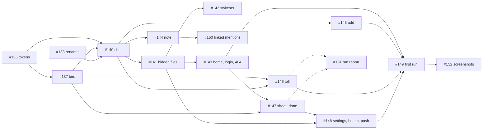

# App redesign, delivery plan

> **For agentic workers:** REQUIRED SUB-SKILL: use superpowers:subagent-driven-development, one subagent per issue, one PR per issue, the lead reviews and squash-merges. Each issue's body is the task card: files, interfaces, acceptance criteria, tests and docs are there, not repeated here.

**Goal:** ship the approved redesign (Obsidian-like look, the bird as mascot, every screen, the first-run tour) without ever breaking the app on `main`.

**Architecture:** four milestones in dependency order (foundations, shell, screens, first run), each a set of small PRs that leave the app working; phase 2 holds what needs new data from the agent. Tokens and the bird go first so every later screen is built once, on the final look.

**Tech stack:** Preact + Vite + TypeScript (app), Hono on Cloudflare Workers (api), Bash + rclone + Claude Code CLI (agent). No new runtime dependency is planned; self-hosted fonts are static files.

**Spec:** `docs/superpowers/specs/2026-09-27-app-redesign-design.md`. Screens: `docs/design/screens/` (generated by `docs/design/gen.py`).

## Global constraints

- Everything in English: code, comments, docs, UI copy. "your notes", "your Bower folder", never "vault" in the UI.
- No personal data, no secrets, anywhere. `scripts/check-sanitized.sh` gates CI.
- Cost first: no new runtime dependency without a one-line reason in the PR; free tiers only.
- TypeScript strict, no `any`; explicit return types on exports; files `kebab-case.ts`.
- Errors never swallowed: Worker returns `{ error: { code, message } }` with the right status; the app shows one sentence and logs the rest.
- Tests where logic lives, hermetic (no network, no real Google or Claude). Pure functions unit-tested; handlers happy path plus one failure; UI smoke only when cheap.
- Motion: transform and opacity only; `prefers-reduced-motion` honoured; durations from the motion tokens (120, 200, 320 ms).
- Accessibility: real buttons, links and labelled inputs; icon-only buttons with `aria-label`; dialogs trap focus and close on Escape; 44 px touch targets; text 4.5:1.
- Tidy up is on demand. No copy, screen or setting may suggest a schedule.
- One issue, one PR: title = issue title, body per the template, starts `Closes #n`, "Left out" filled in, label `needs-review`. The lead merges.

## Milestones and order

| Milestone | Issues | Depends on | Why this order |
| --- | --- | --- | --- |
| M6 · Foundations | #136 tokens and fonts · #137 the bird · #138 rename Tidy up · #139 README and design sources | main | Every later PR uses the tokens and the bird; the rename touches copy everywhere and is easiest before the screens change. #139 is this branch. |
| M7 · Shell and explorer | #140 shell, drawer, nav · #141 hidden app files · #142 quick switcher | M6 | The shell is the frame every screen sits in. Hidden files change what the index exposes, so the switcher (#142) comes after them. |
| M8 · Screens | #143 Home, Login, Not invited, Not found · #144 Note · #145 Add · #146 Tell · #147 Tidying up sheet, Done · #148 Settings, Health, Privacy, push prompt | M7 | Independent of each other except #147 after #143 (the Done state lives on Home) and #148 after #147 (the push prompt is shown after the first finished run). Can run in parallel worktrees. |
| M9 · First run | #149 welcome, folder, building, tour, `tourSeenAt` | M8 | The tour points at Add, the pill and Tell as they will finally look. |
| M10 · Phase 2 | #150 linked mentions · #151 per-message status from the runner · #152 screenshots and demo | M8 or M9 | New data from the agent, and real pictures once the screens exist. |

### Dependency graph

### Sizing

| Issue | Size | Model for the implementer | Notes |
| --- | --- | --- | --- |
| #136 | M | Sonnet | Mostly CSS and a font subset; the contrast script decides. |
| #137 | L | Opus | The rig, the CSS, `build.py`; the riskiest visual work. Review on a phone. |
| #138 | S | Sonnet | Grep-driven. |
| #139 | M | done | This branch. |
| #140 | L | Opus | Layout, focus management, keyboard; touches every screen. |
| #141 | M | Sonnet | One pure function and its callers. |
| #142 | M | Sonnet | Replaces a component; keyboard handling needs care. |
| #143 to #146 | M each | Sonnet | Parallelisable in worktrees once M7 is merged. |
| #147 | M | Sonnet | Reuses the run store; scene from #137. |
| #148 | M | Sonnet | Wide but shallow. |
| #149 | L | Opus | Worker field, validation, three screens and the tour. |
| #150, #151 | L | Opus | Agent and Worker changes; each needs a spike paragraph in the PR. |
| #152 | S | owner | Needs a real demo account. |

Estimated at one to two PRs a day for a single implementer stream: M6 in a week, M7 in a week, M8 in two weeks with parallel worktrees, M9 in a week. Phase 2 unscheduled.

## Review focus

Inputs the spec implies but no single issue's tests exercise; the lead checks these on every review and asks for the test where missing:

1. **A note whose file name is `Bower - …` written by the user, not the app** (an instruction note they typed by hand in Drive): it must be hidden like the app's own and still count as pending. #141's `isAppFile` test covers the name; the `pendingCount` unchanged criterion covers the count.
2. **`prefers-reduced-motion` on a phone** while a run is active: no loop anywhere (header bird, pill, sheet, tour). #137's `birdClasses` test with `reducedMotion` covers the class list; the sheet's "pulsing dot" criterion covers the fallback.
3. **The tour on a tiny viewport (360 px) with the keyboard only**: every coach mark reachable, Escape skips, focus returns. #149's keyboard criterion.
4. **A `/status` payload without counts or without `items`** (an older instance): sheet shows the indeterminate bar, Tell shows "Sent". #147's `progressFor` and #146's `statusLineFor` tests cover the absent case.
5. **Fonts blocked or slow**: the system stack shows text at once (`font-display: swap`), no layout jump large enough to move the pill under the finger. #136's build check (no Google Fonts request) plus a manual check listed in its PR.

## How each issue is run

1. The lead creates a worktree per issue (`feat/<n>-<slug>` from `main`) and dispatches a subagent with the issue body, the spec section it names and the screen files it names.
2. The subagent works test-first per the issue's Tests section, keeps commits small, runs the four checks, opens the PR with the template, labels `needs-review`, never merges.
3. A fresh reviewer subagent (or the lead) reads the full diff against the issue's acceptance criteria, greps for personal data, checks reduced motion and keyboard where the issue touches UI, and posts "Review: approved" or "changes requested".
4. The lead squash-merges, deletes the branch, prunes the worktree, and moves to the next issue in the order above.

## Definition of done for the redesign

- Every issue in M6 to M9 closed by a merged PR.
- `main` deployed to the owner's instance and used for a week with the tour seen once.
- `docs/brand.md`, `docs/runbook.md`, `docs/testing.md` and `docs/privacy.md` describe the app as shipped.
- #152 opened for screenshots; #150 and #151 scheduled or explicitly parked.
